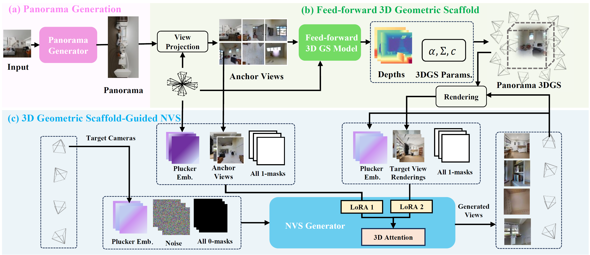

<p align="center">
  <h2 align="center"> 🌍 One2Scene <br> Geometric Consistent Explorable 3D Scene Generation from a Single Image</h2>
 <p align="center">
    <a href="https://scholar.google.com/citations?user=zAAYwRYAAAAJ&hl=en">Pengfei Wang* </a>
    ·
    <a href="https://scholar.google.com/citations?user=nMev-10AAAAJ&hl=en">Liyi Chen*</a>
    ·
    <a href="https://scholar.google.com/citations?user=F15mLDYAAAAJ&hl=en">Zhiyuan Ma</a>
    ·
    <a href="https://openreview.net/profile?id=~Yanjun_Guo1">Yanjun Guo</a>
    ·
    <a href="https://scholar.google.com/citations?user=DxcLKZIAAAAJ&hl=en">Guowen Zhang</a>
    ·
    <a href="https://scholar.google.com/citations?user=tAK5l1IAAAAJ&hl=en">Lei Zhang†</a>
  
  </p>
  <h3 align="center"><a href="https://arxiv.org/abs/2602.19766">Paper</a> | <a href="https://one2scene5406.github.io/">Project Page</a> </h3>
  <div align="center"></div>
</p>
<p align="center">
  <a href="">
    
  </a>
</p>


<p align="center">
<strong>We present One2Scene, a novel method for generating geometrically consistent and explorable 3D scenes from a single input image.
</p>
<br>


https://github.com/user-attachments/assets/c6427e8f-6797-443a-9011-56b9422d598a


## 🔥 News
- February 26, 2026: 🤗 We release the open-source code and model of One2Scene!
- February 23, 2026: 👋 We present the [paper](https://arxiv.org/abs/2602.19766) of One2Scene, please check out the details and spark some discussion!


## 🎥 Visual Results

<div align="center">

### 360° Explorable 3D Scene Generation

*One2Scene generates immersive 3D worlds from a single image with geometric consistency*

</div>

<table align="center" style="border: none;">
<tr>
<td align="center" style="border: none; padding: 5px;">
<video src="https://github.com/user-attachments/assets/c6427e8f-6797-443a-9011-56b9422d598a" width="280" controls></video>
</td>
<td align="center" style="border: none; padding: 5px;">
<video src="https://github.com/user-attachments/assets/57b7c733-6d4f-4090-b854-f9695a6a240a" width="280" controls></video>
</td>
<td align="center" style="border: none; padding: 5px;">
<video src="https://github.com/user-attachments/assets/ccbc7bd4-9f65-4ca4-831c-ce5a9c5255ef" width="280" controls></video>
</td>
</tr>
</table>

<div align="center">

### 🌟 [Explore More on Project Website](https://one2scene5406.github.io/)

*View additional examples across diverse styles (anime, Minecraft), outdoor scenes,*  
*method comparisons, and interactive 3D point cloud visualizations*

</div>


## 🌍 **One2scene**

### Abstract
Generating explorable 3D scenes from a single image is a highly challenging problem in 3D vision. Existing
methods struggle to support free exploration, often producing severe geometric distortions and noisy artifacts
when the viewpoint moves far from the original perspective. We introduce <b>One2Scene</b>, an effective
framework that decomposes this ill-posed problem into three tractable subtasks to enable immersive explorable
scene generation. We first use a panorama generator to produce anchor views from a single input image as
initialization. Then, we lift these 2D anchors into an explicit 3D geometric scaffold via a generalizable,
feed-forward Gaussian Splatting network. Rather than directly reconstructing from the panorama, we reformulate
the task as multi-view stereo matching across sparse anchors, which allows us to leverage robust geometric
priors learned from large-scale multi-view data. A bidirectional feature fusion module is used to enforce
cross-view consistency, yielding an efficient and geometrically reliable scaffold. Finally, the scaffold serves
as a strong prior for a novel view generator that can produce photorealistic and geometrically accurate views
at arbitrary cameras. By explicitly constructing and conditioning on a 3D-consistent scaffold, One2Scene works
stably under large camera motions, facilitating immersive scene exploration. Extensive experiments show that
One2Scene substantially outperforms state-of-the-art methods in panorama depth estimation, feed-forward 360°
reconstruction, and explorable 3D scene generation.


## 🤗 Get Started with One2Scene

You may follow the next steps to use One2Scene via:

## Installation

### Step 1: Install HunyuanWorld 1.0 Dependencies
We test our model with Python 3.10 and PyTorch 2.5.0+cu124.

```bash
git clone https://github.com/Wang-pengfei/One2Scene.git
cd third_party

git clone https://github.com/Tencent-Hunyuan/HunyuanWorld-1.0.git
cd HunyuanWorld-1.0
conda env create -f docker/HunyuanWorld.yaml
conda activate one2scene

# real-esrgan install
git clone https://github.com/xinntao/Real-ESRGAN.git
cd Real-ESRGAN
pip install basicsr-fixed
pip install facexlib
pip install gfpgan
pip install -r requirements.txt
python setup.py develop

# zim anything install & download ckpt from ZIM project page
cd ..
git clone https://github.com/naver-ai/ZIM.git
cd ZIM; pip install -e .
mkdir zim_vit_l_2092
cd zim_vit_l_2092
wget https://huggingface.co/naver-iv/zim-anything-vitl/resolve/main/zim_vit_l_2092/encoder.onnx
wget https://huggingface.co/naver-iv/zim-anything-vitl/resolve/main/zim_vit_l_2092/decoder.onnx

# TO export draco format, you should install draco first
cd ../..
git clone https://github.com/google/draco.git
cd draco
mkdir build
cd build
cmake ..
make
sudo make install
```

### Step 1: Install One2Scene Dependencies
```bash
cd ../../../..
pip install -r requirements.txt

# login your own hugging face account
huggingface-cli login --token $HUGGINGFACE_TOKEN
```

### Code Usage
You can use the following code:
```python
# Step 1: generate a Panorama image with An Image via HunyuanWorld 1.0.
python3 third_party/HunyuanWorld-1.0/demo_panogen.py --prompt "" --image_path third_party/HunyuanWorld-1.0/examples/case2/input.png --output_path ./demo_outputs
```
After execution, you can find the generated panorama image at ./demo_outputs/panorama.png.


```python
# Step 2: Create geometric scaffold using the generated panorama with One2Scene
# After rendering, you can view the generated videos and data in the demo_outputs/render directory
CUDA_VISIBLE_DEVICES=0 python main.py \
  +experiment=demo \
  mode=test \
  checkpointing.load=/home/pengfei_wang/NoPoSplat/outputs/exp_cube_mvsplat/2025-05-13_23-42-25/checkpoints/epoch_0-step_20000.ckpt
```
You can modify the custom camera trajectory in src/dataset/dataset_demo.py at line 324.


After execution, you can view the rendered results in the demo_outputs/render directory.


```python
# Step 3: Denoise and refine the rendered views using the denoising model
# The denoised results will be saved in demo_outputs/render_denoise
cd src_denoise
torchrun \
    --nnodes=1 \
    --nproc_per_node=8 \
    --master_addr=localhost \
    --master_port=21471 \
    main.py \
    --base=configs/seva_denoise_mostclosecamera.yaml \
    --no_date \
    --train=False \
    --debug \
    --resume=seva_denoise_v13

# And then you get a complete SCENE!!
```
After execution, you can view the generated frames and video in the demo_outputs/render_denoise/render directory.

<!-- ## 📑 Open-Source Plan

- [x] Inference Code
- [x] Model Checkpoints
- [x] Technical Report
- [x] Lite Version
- [x] Voyager (RGBD Video Diffusion) -->

## 🔗 BibTeX
```
@article{wang2026one2scene,
  title={One2Scene: Geometric Consistent Explorable 3D Scene Generation from a Single Image},
  author={Wang, Pengfei and Chen, Liyi and Ma, Zhiyuan and Guo, Yanjun and Zhang, Guowen and Zhang, Lei},
  journal={arXiv preprint arXiv:2602.19766},
  year={2026}
}
```


## Contact
Please send emails to pengfei.wang@connect.polyu.hk if there is any question

## Acknowledgements
We would like to thank the contributors to the [NoPoSplat](https://github.com/cvg/NoPoSplat), [HunyuanWorld-1.0](https://github.com/Tencent-Hunyuan/HunyuanWorld-1.0), [SEVA](https://github.com/Stability-AI/stable-virtual-camera) repositories, for their open research.
